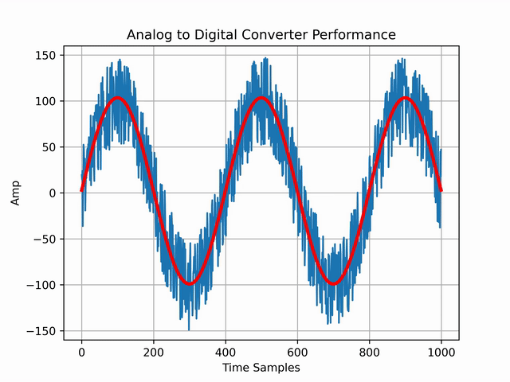

# SigFit - Sine Wave Fitting for Python

I work with Analog To Digital Converters (ADCs) for my research project and I need to fit sine waves frequently to evaluate their performance.

I wrote the SigFit sine fitting library in C language but later I needed to use Python so wrappd my code with Python; In other words [ extended Python with C/C++](https://docs.python.org/3/extending/extending.html)

# Features:

This code has two modes:

* Three Parameter Fitting
* Four Parameter Fitting

## Three Parameter Fitting

Three Paramter Fitting requires the Frequency of input signal, Sampling Frequency and Data array and will return co-efficients of a sine wave.

returned object: (A, B, C)

Acos(wt) + Bsin(wt) + C

## Four Parameter Fitting

Four Parameter Fitting accepts the arguments of Three Paramter Fitting as well as an initial guessed frequency. The output is co-efficients of the a sine wave plus the best fitted frequency. I have tested it, it's very accurate.

Four Parameter Fitting is implemented in C, but it's not wrapped in Python yet.

returned object: (A, B, C, Frequency)

# Performance:
I haven't done any benchmark tests but it's fast! The overhead comes from converting Python list to C array. If you know how to speed-up the conversion, please go ahead and fix it. I'll accept your pull request.

# Installation:

It's on PyPi. Just do:

    $ pip install SigFit

# Usage:

The usage is extremely easy:

    import SigFit

    #data_samples = your noisy data samples
    #freq = the frequency of the data
    #fs = the sampling frequency
    A, B, C = SigFit.FitThreeParam(data_samples, freq, fs)

# Acknowledge:
This algorithm was written based on the following paper written by Peter Händel

[Properties of the IEEE-STD-1057 four-parameter sine wave fit algorithm](https://ieeexplore.ieee.org/document/893254 "Properties of the IEEE-STD-1057 four-parameter sine wave fit algorithm")

Unfortunately, Dr. Peter Händel, at KTH in Sweden passed away in 2019 after a long period of illness.